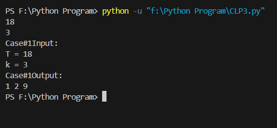

This Python program finds a list of k numbers (0–9) whose product equals a given target integer T. The program uses brute-force search to generate all possible combinations of the numbers and checks which combination matches the target product.

How It Works
User inputs the target integer T and list length k.

The program generates all possible combinations of k numbers between 0 and 9.

It checks the product of each combination and prints the valid combination if found.

